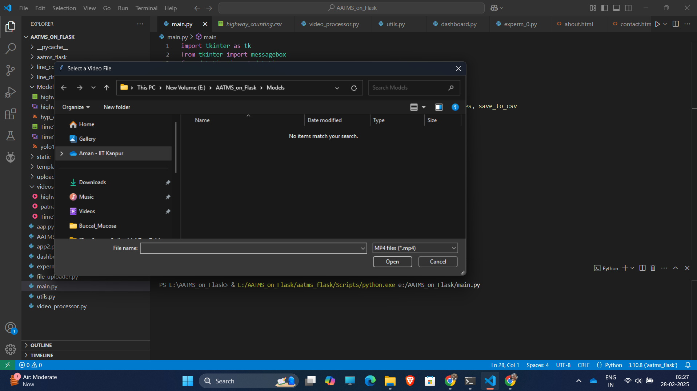
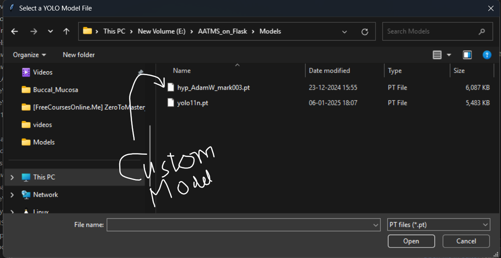
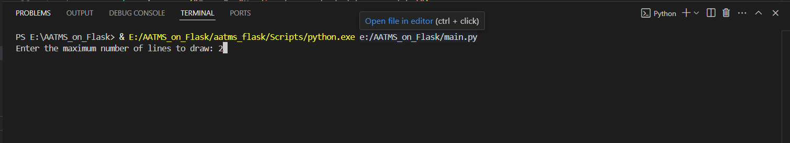
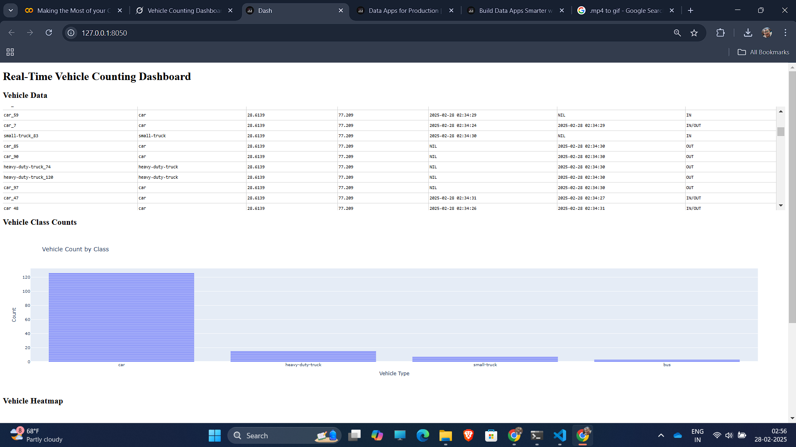

# Airshed-Advance-Traffic-Monitoring-System-AATMS-
AATMS Developed by the Information Technology Team lead and Research and Development Engineer Mr. Aman Sah ,   @Airshed Professional Pvt. Ltd. India . The software uses state of the art Deep Learning and Machine Learning Techniques for precise Vehicle Detection - Tracking - and Counting of Indian Vehicles in diverse conditions and Environment. 

# Vehicle Counting Project

A sophisticated, web-based application built with Dash Plotly for real-time vehicle detection and counting. This project leverages YOLO for object detection, processes video streams, and provides an interactive dashboard to visualize vehicle data—all within a seamless browser interface.

## Table of Contents
- [Features](#features)
- [Screenshots](#screenshots)
- [Installation](#installation)
- [Usage](#usage)
- [Project Structure](#project-structure)
- [Dependencies](#dependencies)
- [Contributing](#contributing)
- [License](#license)

## Features
- **Multi-Page Interface**: Navigate through Home, Line Drawing, and Processing pages.
- **File Uploads**: Upload video (e.g., MP4) and YOLO model (e.g., `.pt`) files directly in the browser.
- **Interactive Line Drawing**: Define regions of interest (ROIs) by drawing lines on the first video frame.
- **Real-Time Processing**: Display annotated video frames with vehicle detections and line crossings.
- **Comprehensive Dashboard**:
  - Scrollable table of vehicle data (`Vehicle ID`, `Class`, `Latitude`, `Longitude`, `Timestamps`, `IN/OUT`).
  - Bar plot of vehicle class counts.
  - Heatmap visualization of vehicle locations (default: New Delhi coordinates).
- **OOP Design**: Modular, maintainable code using Object-Oriented Programming principles.

## Screenshots

### Video selection window
Upload video and model files to start the process.

### Model Selection window

### Line Drawing Page
Draw lines on the first frame to define counting regions.

### Processing Page
View annotated frames alongside a real-time dashboard.

